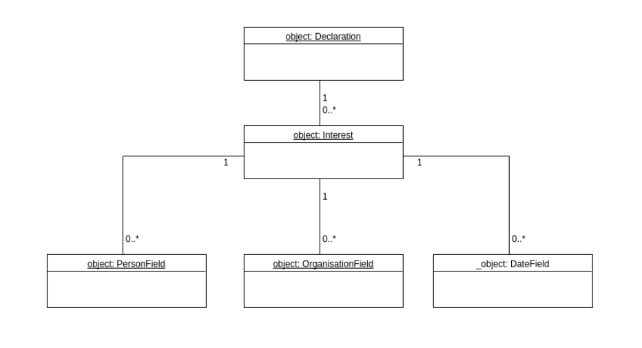

Standardising Interest Declarations
===================================

## Background

(todo - brief overview of project, plus links, and how the idea of standardising declarations of interest related to the work.)

## Status of the draft data format

We present here an idea for standardising information declared by people about their interests. The structure of the data is informed by:

* the experience of dealing with unstructured, variously formatted information in this domain,
* an understanding of how tightly the format of declarations can be tied to regulatory requirements and language,
* a recognition that an 'interest' may cover an extremely diverse range of activities, roles and engagements,
* an assumption that the added value of a structured format is in enabling patterns across declarations to be more easily identified,
* experience elsewhere in the transparency field which highlights the importance of historical data on declarations.

The draft format is merely an opener in a conversation. We hope that it might provoke interest and criticism. We hope it can feed into further work in this domain. 

The [draft data format](https://docs.google.com/spreadsheets/d/1QCVkxi1B-i3xx1lVJXe1ihhQSrgtOEeAxj8CHoFgTVA/edit#gid=0) is documented in a spreadsheet for convenience. Ultimtaely it could be rendered in JSON schema.

## Overview and link to draft data format

The data model encapsulates an Interest object, placing it within a Declaration. This allows processes of declaration and re-declaration (or confirmation) to be treated and understood separately from the lifecycle and nature of the interest itself. (For example, a person may be required to declare an interest which actually sits with a family member or business partner.)

The Interest object itself is only semi-structured. The model is built on the assumption that it is primarly *dates, people and organisations* associated with interests that people wish to link to other information. (We can imagine that there might be other notable information types - for instance, location. Beginning with the most obvious and widely applicable information types seemed wise.) We leave it up to data publishers to provide in their datasets the precise field names for dates, people and organisations. More information about this feature of the model can be found below under Key features > Flexibility.

    
[View the draft data format](https://docs.google.com/spreadsheets/d/1QCVkxi1B-i3xx1lVJXe1ihhQSrgtOEeAxj8CHoFgTVA/edit#gid=0)

## Key features

* Modelling declarations
		Change over time
* Flexibility
    data profiles
* Open codelists

## Outstanding issues

* Republishing & publisher metadata
* Change over time. Adding, updating or ending an interest is done as part of the declaration, by the declarer. Retraction is an action of the publisher. Relates to the above.
* Packaging

## About

(todo- more detail about who we are and what the project was)
